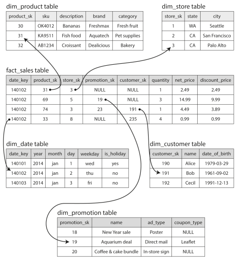

<!-- # Designing Data Intensive Applications - Notes -->
<!-- TOC depthFrom:1 depthTo:6 withLinks:1 updateOnSave:1 orderedList:0 -->

	- [Chapter 1 - Reliable, Scalable and Maintainable Applications](#chapter-1-reliable-scalable-and-maintainable-applications)
		- [Reliability](#reliability)
		- [Scalability](#scalability)
			- [Approaches for Coping with Load](#approaches-for-coping-with-load)
		- [Maintainability](#maintainability)
			- [Operability](#operability)
			- [Simplicity](#simplicity)
			- [Evolvability](#evolvability)
	- [Chapter 2 - Data Models and Query Languages](#chapter-2-data-models-and-query-languages)
		- [Relational Model vs Document Model](#relational-model-vs-document-model)
		- [The Birth of NoSQL](#the-birth-of-nosql)
		- [The Object-Relational Mismatch](#the-object-relational-mismatch)
		- [Many-to-One and Many-to-Many Relationships](#many-to-one-and-many-to-many-relationships)
		- [Are Document Databases Repeating History?](#are-document-databases-repeating-history)
		- [Relational Versus Document Databases Today](#relational-versus-document-databases-today)
			- [Which has simpler application code?](#which-has-simpler-application-code)
			- [Schema flexibility in the document model](#schema-flexibility-in-the-document-model)
			- [Data locality for queries](#data-locality-for-queries)
			- [Convergence of document and relational dbs](#convergence-of-document-and-relational-dbs)
	- [Chapter 3 - Storage and Retrieval](#chapter-3-storage-and-retrieval)
		- [Data Structures That Power Your Database](#data-structures-that-power-your-database)
			- [Hash Indexes](#hash-indexes)
			- [SSTables and LSM-Trees](#sstables-and-lsm-trees)
			- [B-Trees](#b-trees)
			- [Keeping everything in memory](#keeping-everything-in-memory)
		- [Transaction Processing or Analytics?](#transaction-processing-or-analytics)
			- [Data Warehousing](#data-warehousing)
		- [Stars and Snowflakes: Schemas for Analytics](#stars-and-snowflakes-schemas-for-analytics)
		- [Column-Orientated Storage](#column-orientated-storage)
			- [Column Compression](#column-compression)
		- [Writing to Column-Orientated storage](#writing-to-column-orientated-storage)
	- [Chapter 4 - Encoding and Evolution](#chapter-4-encoding-and-evolution)
		- [Formats for Encoding Data](#formats-for-encoding-data)
			- [Language-specific Formats](#language-specific-formats)
			- [JSON, XML & Binary Variants](#json-xml-binary-variants)
				- [Binary encoding](#binary-encoding)
			- [Thrift and Protocol Buffers](#thrift-and-protocol-buffers)
				- [Field tags and schema Evolution](#field-tags-and-schema-evolution)
			- [Avro](#avro)
		- [The Merits of Schemas](#the-merits-of-schemas)
		- [Modes of Dataflow](#modes-of-dataflow)
			- [Dataflow Through databases](#dataflow-through-databases)
				- [Different values written at different times](#different-values-written-at-different-times)
			- [Dataflow Through Services: REST and RPC](#dataflow-through-services-rest-and-rpc)
				- [Web Services](#web-services)
				- [The problems with remote procedure calls (RPCs)](#the-problems-with-remote-procedure-calls-rpcs)
				- [Current directions of RPC](#current-directions-of-rpc)
				- [Data encoding and evolution of RPC](#data-encoding-and-evolution-of-rpc)
			- [Message-Passing Dataflow](#message-passing-dataflow)
				- [Message brokers](#message-brokers)
				- [Distributed actor frameworks](#distributed-actor-frameworks)
	- [Chapter 5 - Replication](#chapter-5-replication)
		- [Leaders and Followers](#leaders-and-followers)
			- [Synchronous Versus Asynchronous Replication](#synchronous-versus-asynchronous-replication)
				- [Synchronous](#synchronous)
				- [Asynchronous](#asynchronous)
			- [Setting Up New Followers](#setting-up-new-followers)
			- [Handling Node Outages](#handling-node-outages)
				- [Follower failure: Catch-up recovery](#follower-failure-catch-up-recovery)
				- [Leader failure: Failover](#leader-failure-failover)
			- [Implementation of Replication Logs](#implementation-of-replication-logs)
				- [Statement-based replication](#statement-based-replication)
				- [Write-ahead log (WAL) shipping](#write-ahead-log-wal-shipping)
				- [Logical (row-based) log replciation](#logical-row-based-log-replciation)
				- [Trigger-based replication](#trigger-based-replication)
		- [Problems with Replication Lag](#problems-with-replication-lag)
			- [Reading Your Own writes](#reading-your-own-writes)
			- [Monotonic Reads](#monotonic-reads)
			- [Consistent Prefix Reads](#consistent-prefix-reads)
			- [Solutions for Replication Lag](#solutions-for-replication-lag)
		- [Multi-Leader Replication](#multi-leader-replication)
			- [Use Cases for Multi-Leader Replication](#use-cases-for-multi-leader-replication)
				- [Multi-data center operation](#multi-data-center-operation)
				- [Client with offline operation](#client-with-offline-operation)
				- [Collaborative Editing](#collaborative-editing)
			- [Handling Write Conflicts](#handling-write-conflicts)
				- [Synchronous versus Asynchronous conflict detection](#synchronous-versus-asynchronous-conflict-detection)
				- [Conflict Avoidance](#conflict-avoidance)
				- [Converging towards a consistent state](#converging-towards-a-consistent-state)
				- [Custom conflict resolution logic](#custom-conflict-resolution-logic)
				- [Automatic Conflcit Resolution](#automatic-conflcit-resolution)
			- [Multi-leader Replication Topologies](#multi-leader-replication-topologies)
			- [Leaderless Replication](#leaderless-replication)
				- [Writing to a DB when a node is down](#writing-to-a-db-when-a-node-is-down)
				- [Leaderless Replication Scheme](#leaderless-replication-scheme)
				- [Quorums for reading and Writing](#quorums-for-reading-and-writing)
			- [Limitations of Quorum Consistency](#limitations-of-quorum-consistency)
	- [Chapter 7 - Transactions](#chapter-7-transactions)
		- [The Slippery Concept of a Transaction](#the-slippery-concept-of-a-transaction)
			- [The meaning of ACID](#the-meaning-of-acid)
				- [Atomicity](#atomicity)
				- [Consistency](#consistency)
				- [Isolation](#isolation)
				- [Durability](#durability)
		- [Single-Object and Multi-Object Operations](#single-object-and-multi-object-operations)
			- [Single-object Writes](#single-object-writes)
			- [The need for multi-object Transactions](#the-need-for-multi-object-transactions)
			- [Handling errors and aborts](#handling-errors-and-aborts)
		- [Weak Isolation Levels](#weak-isolation-levels)
			- [Read Committed](#read-committed)
				- [No dirty reads](#no-dirty-reads)
				- [No dirty writes](#no-dirty-writes)
	- [Chapter 8 - The Trouble with Distributed System](#chapter-8-the-trouble-with-distributed-system)
	- [Chapter 10 - Batch Processing](#chapter-10-batch-processing)
		- [Batch Processing with Unix Tools](#batch-processing-with-unix-tools)
			- [Sorting versus in-memory aggregation](#sorting-versus-in-memory-aggregation)
		- [The Unix Philosophy](#the-unix-philosophy)
		- [MapReduce and Distributed Filesystems](#mapreduce-and-distributed-filesystems)
		- [MapReduce Job Execution](#mapreduce-job-execution)
			- [Distributed Execution of MapReduce](#distributed-execution-of-mapreduce)
			- [MapReduce Workflows](#mapreduce-workflows)
		- [Reduce-Side Joins and Grouping](#reduce-side-joins-and-grouping)
			- [Sort-merge joins](#sort-merge-joins)
			- [Group By](#group-by)
			- [Handling Skew](#handling-skew)
		- [Map-Side Joins](#map-side-joins)
			- [Broadcast Hash Joins](#broadcast-hash-joins)
			- [Partitioned hash joins](#partitioned-hash-joins)
			- [Map-side merge joins](#map-side-merge-joins)
			- [MapReduce workflows with map-side joins](#mapreduce-workflows-with-map-side-joins)
		- [The Output of Batch Workflows](#the-output-of-batch-workflows)
			- [Building search indexes](#building-search-indexes)
			- [Key-value stores as batch process output](#key-value-stores-as-batch-process-output)
			- [Philosophy of batch process outputs](#philosophy-of-batch-process-outputs)
		- [Comparing Hadoop to Distributed Databases](#comparing-hadoop-to-distributed-databases)
			- [Diversity of Storage](#diversity-of-storage)
			- [Diversity of processing models](#diversity-of-processing-models)
			- [Designing for frequent faults](#designing-for-frequent-faults)
		- [Beyond MapReduce](#beyond-mapreduce)
			- [Materialization of Intermediate State](#materialization-of-intermediate-state)
			- [Dataflow engines](#dataflow-engines)
			- [Discussion of Materialization](#discussion-of-materialization)
		- [Graphs and Iterative Processing](#graphs-and-iterative-processing)
			- [The pregel processing model](#the-pregel-processing-model)
			- [Parallel execution](#parallel-execution)
		- [High-Level APIs and Languages](#high-level-apis-and-languages)
			- [Specialization for different domains](#specialization-for-different-domains)
	- [Chapter 11 - Stream Processing](#chapter-11-stream-processing)
		- [Transmitting Event Streams](#transmitting-event-streams)
			- [Messaging Systems](#messaging-systems)
			- [Message brokers](#message-brokers)
			- [Message brokers versus databases](#message-brokers-versus-databases)
			- [Multiple Consumers](#multiple-consumers)

<!-- /TOC -->
## Chapter 1 - Reliable, Scalable and Maintainable Applications

Many factors influence the design of a system including:
- skills and experience of people involved
- legacy system dependencies<!-- TOC depthFrom:1 depthTo:6 withLinks:1 updateOnSave:1 orderedList:0 -->

	- [Chapter 1 - Reliable, Scalable and Maintainable Applications](#chapter-1-reliable-scalable-and-maintainable-applications)
		- [Reliability](#reliability)
		- [Scalability](#scalability)
			- [Approaches for Coping with Load](#approaches-for-coping-with-load)
		- [Maintainability](#maintainability)
			- [Operability](#operability)
			- [Simplicity](#simplicity)
			- [Evolvability](#evolvability)
	- [Chapter 2 - Data Models and Query Languages](#chapter-2-data-models-and-query-languages)
		- [Relational Model vs Document Model](#relational-model-vs-document-model)
		- [The Birth of NoSQL](#the-birth-of-nosql)
		- [The Object-Relational Mismatch](#the-object-relational-mismatch)
		- [Many-to-One and Many-to-Many Relationships](#many-to-one-and-many-to-many-relationships)
		- [Are Document Databases Repeating History?](#are-document-databases-repeating-history)
		- [Relational Versus Document Databases Today](#relational-versus-document-databases-today)
			- [Which has simpler application code?](#which-has-simpler-application-code)
			- [Schema flexibility in the document model](#schema-flexibility-in-the-document-model)
			- [Data locality for queries](#data-locality-for-queries)
			- [Convergence of document and relational dbs](#convergence-of-document-and-relational-dbs)
	- [Chapter 3 - Storage and Retrieval](#chapter-3-storage-and-retrieval)
		- [Data Structures That Power Your Database](#data-structures-that-power-your-database)
			- [Hash Indexes](#hash-indexes)
			- [SSTables and LSM-Trees](#sstables-and-lsm-trees)
			- [B-Trees](#b-trees)
			- [Keeping everything in memory](#keeping-everything-in-memory)
		- [Transaction Processing or Analytics?](#transaction-processing-or-analytics)
			- [Data Warehousing](#data-warehousing)
		- [Stars and Snowflakes: Schemas for Analytics](#stars-and-snowflakes-schemas-for-analytics)
		- [Column-Orientated Storage](#column-orientated-storage)
			- [Column Compression](#column-compression)
		- [Writing to Column-Orientated storage](#writing-to-column-orientated-storage)
	- [Chapter 4 - Encoding and Evolution](#chapter-4-encoding-and-evolution)
		- [Formats for Encoding Data](#formats-for-encoding-data)
			- [Language-specific Formats](#language-specific-formats)
			- [JSON, XML & Binary Variants](#json-xml-binary-variants)
				- [Binary encoding](#binary-encoding)
			- [Thrift and Protocol Buffers](#thrift-and-protocol-buffers)
				- [Field tags and schema Evolution](#field-tags-and-schema-evolution)
			- [Avro](#avro)
		- [The Merits of Schemas](#the-merits-of-schemas)
		- [Modes of Dataflow](#modes-of-dataflow)
			- [Dataflow Through databases](#dataflow-through-databases)
				- [Different values written at different times](#different-values-written-at-different-times)
			- [Dataflow Through Services: REST and RPC](#dataflow-through-services-rest-and-rpc)
				- [Web Services](#web-services)
				- [The problems with remote procedure calls (RPCs)](#the-problems-with-remote-procedure-calls-rpcs)
				- [Current directions of RPC](#current-directions-of-rpc)
				- [Data encoding and evolution of RPC](#data-encoding-and-evolution-of-rpc)
			- [Message-Passing Dataflow](#message-passing-dataflow)
				- [Message brokers](#message-brokers)
				- [Distributed actor frameworks](#distributed-actor-frameworks)
	- [Chapter 5 - Replication](#chapter-5-replication)
		- [Leaders and Followers](#leaders-and-followers)
			- [Synchronous Versus Asynchronous Replication](#synchronous-versus-asynchronous-replication)
				- [Synchronous](#synchronous)
				- [Asynchronous](#asynchronous)
			- [Setting Up New Followers](#setting-up-new-followers)
			- [Handling Node Outages](#handling-node-outages)
				- [Follower failure: Catch-up recovery](#follower-failure-catch-up-recovery)
				- [Leader failure: Failover](#leader-failure-failover)
			- [Implementation of Replication Logs](#implementation-of-replication-logs)
				- [Statement-based replication](#statement-based-replication)
				- [Write-ahead log (WAL) shipping](#write-ahead-log-wal-shipping)
				- [Logical (row-based) log replciation](#logical-row-based-log-replciation)
				- [Trigger-based replication](#trigger-based-replication)
		- [Problems with Replication Lag](#problems-with-replication-lag)
			- [Reading Your Own writes](#reading-your-own-writes)
			- [Monotonic Reads](#monotonic-reads)
			- [Consistent Prefix Reads](#consistent-prefix-reads)
			- [Solutions for Replication Lag](#solutions-for-replication-lag)
		- [Multi-Leader Replication](#multi-leader-replication)
			- [Use Cases for Multi-Leader Replication](#use-cases-for-multi-leader-replication)
				- [Multi-data center operation](#multi-data-center-operation)
				- [Client with offline operation](#client-with-offline-operation)
				- [Collaborative Editing](#collaborative-editing)
			- [Handling Write Conflicts](#handling-write-conflicts)
				- [Synchronous versus Asynchronous conflict detection](#synchronous-versus-asynchronous-conflict-detection)
				- [Conflict Avoidance](#conflict-avoidance)
				- [Converging towards a consistent state](#converging-towards-a-consistent-state)
				- [Custom conflict resolution logic](#custom-conflict-resolution-logic)
				- [Automatic Conflcit Resolution](#automatic-conflcit-resolution)
			- [Multi-leader Replication Topologies](#multi-leader-replication-topologies)
			- [Leaderless Replication](#leaderless-replication)
				- [Writing to a DB when a node is down](#writing-to-a-db-when-a-node-is-down)
				- [Leaderless Replication Scheme](#leaderless-replication-scheme)
				- [Quorums for reading and Writing](#quorums-for-reading-and-writing)
			- [Limitations of Quorum Consistency](#limitations-of-quorum-consistency)
	- [Chapter 7 - Transactions](#chapter-7-transactions)
		- [The Slippery Concept of a Transaction](#the-slippery-concept-of-a-transaction)
			- [The meaning of ACID](#the-meaning-of-acid)
				- [Atomicity](#atomicity)
				- [Consistency](#consistency)
				- [Isolation](#isolation)
				- [Durability](#durability)
		- [Single-Object and Multi-Object Operations](#single-object-and-multi-object-operations)
			- [Single-object Writes](#single-object-writes)
			- [The need for multi-object Transactions](#the-need-for-multi-object-transactions)
			- [Handling errors and aborts](#handling-errors-and-aborts)
		- [Weak Isolation Levels](#weak-isolation-levels)
			- [Read Committed](#read-committed)
				- [No dirty reads](#no-dirty-reads)
				- [No dirty writes](#no-dirty-writes)
	- [Chapter 8 - The Trouble with Distributed System](#chapter-8-the-trouble-with-distributed-system)
	- [Chapter 10 - Batch Processing](#chapter-10-batch-processing)
		- [Batch Processing with Unix Tools](#batch-processing-with-unix-tools)
			- [Sorting versus in-memory aggregation](#sorting-versus-in-memory-aggregation)
		- [The Unix Philosophy](#the-unix-philosophy)
		- [MapReduce and Distributed Filesystems](#mapreduce-and-distributed-filesystems)
		- [MapReduce Job Execution](#mapreduce-job-execution)
			- [Distributed Execution of MapReduce](#distributed-execution-of-mapreduce)
			- [MapReduce Workflows](#mapreduce-workflows)
		- [Reduce-Side Joins and Grouping](#reduce-side-joins-and-grouping)
			- [Sort-merge joins](#sort-merge-joins)
			- [Group By](#group-by)
			- [Handling Skew](#handling-skew)
		- [Map-Side Joins](#map-side-joins)
			- [Broadcast Hash Joins](#broadcast-hash-joins)
			- [Partitioned hash joins](#partitioned-hash-joins)
			- [Map-side merge joins](#map-side-merge-joins)
			- [MapReduce workflows with map-side joins](#mapreduce-workflows-with-map-side-joins)
		- [The Output of Batch Workflows](#the-output-of-batch-workflows)
			- [Building search indexes](#building-search-indexes)
			- [Key-value stores as batch process output](#key-value-stores-as-batch-process-output)
			- [Philosophy of batch process outputs](#philosophy-of-batch-process-outputs)
		- [Comparing Hadoop to Distributed Databases](#comparing-hadoop-to-distributed-databases)
			- [Diversity of Storage](#diversity-of-storage)
			- [Diversity of processing models](#diversity-of-processing-models)
			- [Designing for frequent faults](#designing-for-frequent-faults)
		- [Beyond MapReduce](#beyond-mapreduce)
			- [Materialization of Intermediate State](#materialization-of-intermediate-state)
			- [Dataflow engines](#dataflow-engines)
			- [Discussion of Materialization](#discussion-of-materialization)
		- [Graphs and Iterative Processing](#graphs-and-iterative-processing)
			- [The pregel processing model](#the-pregel-processing-model)
			- [Parallel execution](#parallel-execution)
		- [High-Level APIs and Languages](#high-level-apis-and-languages)
			- [Specialization for different domains](#specialization-for-different-domains)
	- [Chapter 11 - Stream Processing](#chapter-11-stream-processing)
		- [Transmitting Event Streams](#transmitting-event-streams)
			- [Messaging Systems](#messaging-systems)
			- [Message brokers](#message-brokers)
			- [Message brokers versus databases](#message-brokers-versus-databases)
			- [Multiple Consumers](#multiple-consumers)

<!-- /TOC -->
- organisation's tolerance of risk
- regulatory constraints

### Reliability

- application performs the function that the user expected
- tolerate user mistakes or using the software in unexpected ways
- performance is good enough for the use case, under expected load and data volume
- system prevents unauthorized access and abuse

"continuing to work correctly, even when things go wrong"

fault - a component of the system deviating from spec
failure - the system as a whole stops providing the required service to the user

It can make sense to __increase__ the rate of faults by triggering them deliberately, for example by killing processes randomly without warning e.g. Netflix Chaos Monkey.

Hardware faults, software faults and human faults.

There are situations in which we choose to sacrafice reliability in order to reduce development cost (e.g. developing prototype for an unproven market) or operational cost (e.g. for a service with a very narrow profit margin), but we should be very concious when cutting corners.

### Scalability

The ability of a system to cope with increased load.

It is meaningless to say "X is scalable" or "Y doesn't scale". Rather, discussing scalability means consdiering questions like "if the system grows in a particular way, whow can we add compute resource to handle the additional load?"

Load can be described with a few numbers called __load parameters__, which depends on the architecture of your system e.g. requests per second to a server, the number of simultaneous active users in a chat room. Perhaps the average case matters, or perhaps your bottleneck is dominated by a small numver of extreme cases.

When you increase a load parameter and keep system resources unchanged, how is the performance of the system affected?

When you increase a load parameter, how much do you need to increase the resource if you want to keep performance unchanged?

Batch processing systems like Hadoop care about _throughput_, number of records we can process per second.

Online systems care about _response time_, the time between sending a request and receiving a response. _Response time_ will vary with identical calls, so should be thought of as a distribution of values, not a single number.

Percentiles are usually the best way to describe this distribution: p50, p95, p99, p999.

Amazon observed that a 100ms increase in response time reduces sales by 1%, others report that a 1-second slowdown reduces custoemr satisfaction metric by 16%.

Percentiles are often used in SLAs e.g. service is considered to be up if it has a median response time of less than 200ms and p99 < 1000ms.

When several backend calls are needed to serve a request, it takes just a single slow backend request to slow down the entire end-user request.

#### Approaches for Coping with Load

An architecture appropriate for one level of load is unlikely to cope with 10 times that load, the architecture will be rethought quite often.

vertical scaling (more powerful machine) / horizontal scaling (distributing load across multiple machines)

Good architectures involve a pragmatic mixture of the two approaches, several fairly powerful machines can be simpler and cheaper than a large number of small VMs.

_elastic systems_ add compute when a load increase is detected, whereas others are scaled manually. Manual scaling is simpler and has fewer operational suprises, elastic is good if load is highly unpredictable.

Distributing stateful systems across nodes can increase a lot of complexity, common wisdom says to keep you database on a single node until scaling cost or high availability requirements force you to make it distributed.

Architectures are highly specific to the application - there is no magic scaling sauce.

Architectures that scale well for a particular application are built around assumptions of which operations will be common and which will be rare - the load parameters.

### Maintainability

The majority of the cost of software is in its ongoing maintenance: fixing bugs, investigating failures, repaying tech debt and adding new features.

We can and should design software in such a way that will minimize pain during maintenance, avoiding creating legacy software.

Three design principles for software systems:
1) Operability - easy for operations teams to keep the system running smoothly
2) Simplicity - easy for new engineers to understand the system
3) Evolvability - easy for engineers to make changes to the system in the future

#### Operability

Typically operations teams are responsbile for the following...
- Monitoring the health of a system and restoring service if it falls into a bad state
- Tracking the cause of problems like system failure or degraded performance
- Keeping software and platforms up to date, security patches
- Keeping tabs on how systems affect each other, so a problematic change can be avoided before it causes damage
- Establishing good practices and tools for deployment, config management
- Defining processes that make operations predictable and help keep production environments stable
- Preserving the organization's knowledge, even as individual people come and go

Good operations makes routine tasks easy, allowing the team to focus on high value tasks. Data systems can do the following to make routine tasks easy:
- Providing visibility into the runtime behaviour, with good monitoring
- Providing good support for automation and integration with standard tools
- Avoiding dependency on individual machines
- Providing good documentation and an easy-to-understand operational model
- Self-healing where appropriate, also giving admins control over system state when needed
- Predictable behaviour, minimizing surprises

#### Simplicity

Small software projects can be very simple and expressive, but as they get larger they often become very complex and difficult to understand. This complexity makes systems difficult to understand, slowing down everyone who needs to work on the system.

Simplicity should be a key goal for the systems we build.

Complexity is accidental if it is not inherent in the problem that the software solves but arises only from the implementation.

Good abstractions can hide a great deal of implementation detail behind a clean, simple-to-understand facade.

Finding good abstractions is very hard.

#### Evolvability

Extremely unlikley that your system's requirements will remain unchanged, more likley in a constant state of flux.

Agile working patterns provide a framework for adapting to change. There exist tools and patterns helpful when developing software in a frequently changing environment, such as TDD and refactoring.

The ease with which you can modify a data system and adapt to changing requirements is closely linked to its simplicity and its abstractions.

## Chapter 2 - Data Models and Query Languages

'The limits of my language mean the limits of my world' - Wittgenstein

Data models are how we _think about the problem_ that we are solving

Most applications are built by layering one data model on top of another. The key question is: how is it represented in terms of the next-lower layer?

The basic idea is: each layer hides the complexity of the layers below it by providing a clean data model. These abstractions allow different groups of people to work together effectively.

The data model has such a profound effect on what the software above it can do, so it is important to choose one appropriate to the application.

### Relational Model vs Document Model

SQL is the best-know data model today: data is organized into relations (tables in SQL), where each relation is an unordered collection of tuples (rows in SQL).

Roots of relational database lie in business data processing, use cases typically were _transaction processing_ (sales, banking transactions) and _batch processing_ (invoicing, payroll, reporting).

### The Birth of NoSQL

NoSQL is the latest attempt to overthrow the relational model's dominance.

Several driving forces behind the adoption of NoSQL databases including:
- Need for greater scalability than relational databases can easily achieve: large datasets or high write throughput
- Widespread preference for FOSS over commercial database products
- Specialized query operations that are not well supported by the relational model
- Frustration with the restrictiveness of relational schemas, and a desire for a more dynamic and expressive data model

Different applications have different requirements, and the best choice of one technology for one use case may well be different from the best choice for another use case.

_Polyglot persistence_ relational and nonrelational datastores used in parallel

### The Object-Relational Mismatch

Most application development today is done in OO languages, which leads to the criticism of the SQL data model: if data is stored in relational tables, and awkward translation layer is required between the objects in the application code and the db model of rows, tables and columns. _Impedance mismatch_.

For a Data Structure like a resume, wich is mostly a self-contained _document_, a JSON representation can be quite appropriate.

JSON representation has better _locality_ than the multi-table schema. To fetch a profile in the relational example, you need to either perform multiple queries or perform messy multi-way join between the users and subordinate tables.

### Many-to-One and Many-to-Many Relationships

If the UI has free-text fields for entering region and industry, it makes sense to store them as plain-text strings, but there are advantages to having standardized lists of geographic regions and industries:
- Consistent style and spelling across profiles
- Avoiding ambiguity
- Ease of updating
- Localization support e.g. when the site is transformed into other langauges
- Better search

Whether you store and ID or a text string is a question of duplication. When using and ID, the human-meaningful information is stored in only one place, and everything refers to it using an ID.

The advantage of an ID is that because it has no meaning to humans, it never needs to change.

Removing duplication is the key idea behind _normalization_ in databases.

### Are Document Databases Repeating History?

NoSQL reopened the debate on how best to represent many-to-many relationships in a database.

IBM's Information Management System used a simple data model called the hierarchical mode, which has remarkable similarities to the JSON model of used by document data-bases. Like document databases, it worked well for one-to-many relationships but made many-to-many difficult.

A relational table is a simple collection of tuples, and that's it. The query optimizer automatically decides which parts of the query to execute in which order, and which indexes to use.

### Relational Versus Document Databases Today

Document data model pros: schema flexibility, better performance due to locality and close to data structures used by the application.

Relational data model pros: better support for joins, and many-to-one and many-to-many relationships.

#### Which has simpler application code?

If the data in your application has a document-like structure (tree of one-to-many relationships) then its a good idea to use a document model.

Document model has limitations, you cannot refer directly to a nested item within a document. As long as documents are not too deeply nested, not usually a problem.

Poor support for joins may or may not be a problemm. Many-to-many relationships may never be needed in an analytics applications that uses documents to record which events occurred at which time.

It's possible to reduce the need for joins by denormalizing in a relational model, but then the application needs to do additional work to keep the normalized data consistent.

It is not posssible to say in general which data model leads to simpler application code; it depends on the relationships that exist between data items. For highly connected data,  graph models are the most natural.

#### Schema flexibility in the document model

Most document dbs and JSON support in relational dbs do not enforce schema on the data.

Document dbs are sometimes called _schemaless_, but that is misleading. The code usually assumes some kind of structure that is not enforced by the db. _Schema-on-read_ is more accurate, compared to _schema-on-write_ of relational dbs.

_schema-on-read_ -> dynamic runtime type checking
_schema-on-write_ -> status compile-time type checking

Schema changes have a bad reputation of being slow and requiring downtime. MySQL the worst case.

Schema-on-read approach is advantageous if the items don't all have the same structure. Many different types of objects, not practical to put each type in its own table. Structure is determined by external systems over which you have not control, and may change at anytime.

Schemas useful mechanism for documenting and enforcing that structure.

#### Data locality for queries

A document is usually stored as a single continuous string encoded as JSON, XML or BSON in Mongo.

If application often needs to access the entire document there is a performance advantage to storage locality, having the data split across multiple table can take much longer.

Locality advantage only applies if you need large parts of the document at the same time. DB typically needs to load the entire document even if you only access a small portion, wasteful in large documents.

Locality not just present in the document model. Cassandra and Bigtable have column friendly properties to manage locality.

#### Convergence of document and relational dbs

RethinkDB supports relational-like joins in its query language.

Document and reational dbs becoming more similar over time.

## Chapter 3 - Storage and Retrieval

How does a database store the data we give it, and does it find it again when asked.

In order to tune a storage engine to perform well on your kind of workload, you need to have a rough idea of what the storage engine is doing under the hood.

Big difference between storage engines optimized for transational workloads and those optimized for analytics.

### Data Structures That Power Your Database

Appending to a file is generally very efficient. Many database tables use a _log_, an append-only data file.

Logs have terrible, O(n) performance. To speed this up, we need a different data structure: an _index_. Indexes are additional structures derived from the primary data.

For writes, it's hard to beat the performance of appending to a file. Any kind of index slows down writes, because the index must be updated every time data is written.

Often indexes make the application developer choose indexes, using you knowledge of the typical query patterns.

#### Hash Indexes

Let's say our storage consists of appending to a file, and we want to create an index with a hash map.

Create an index by maintaining an in-memory hash-map where every key is mapping to a byte offset in the data file. Though simplistic, this is how Bitcask works.

This engine is well suited to situations where the value for each key is updated frequently. There are lots of writes, but not too many distinct keys.

How do we eventually avoid running out of disk space? Compaction. Throwing away duplicate keys in the log, keeping only the most recent update.

Other considerations? File format: binary preferred to csv, Deleting records, Crash recovery, Partially written records: checksums, Concurrency control.

Append only logs seem wasteful at first, but append-only is good for a number of reasons:
- Appending and segment merging are sequential operations, much faster than random writes.
- Concurrency and crash recovery are much simpler if segment files are append-only or immutable.

Hash table index also has limitations:
- Hash table must fit in memory. Could maintain on disk but super painful and slow.
- Range queries are not efficient, looking for sequences requires looking up every key.

#### SSTables and LSM-Trees

#### B-Trees

B-Trees are the standard index implementation in almost all relational databases, and many non-relational databases use them too.

Like SSTables, B-Trees keep key-value pairs sorted by key, which allows efficient key-value lookups and range queries.

B-Trees break the database down into fixed size _blocks_ or _pages_, traditionally 4kb in siz, and read or write one page at a time.

Each page can be identified using an address or location, which allows one page to refer to another, similar to a pointer.

The algorithm ensures that the tree remains _balanced_, n keys always has depth O(log n).

To make databases reliant to crashes, it is common for B-tree implementations to include _write ahead logs (WAL)_. Append-only file to which every B-Tree modification must be written before being applied to tree itself.

#### Keeping everything in memory

As RAM becomes cheaper, the cost-per-GB argument is eroded. Many datasets are simply not that big so it is feasible to keep everything in memory.

Memcached is an in-memory key-value store intended for caching use only, where it is ok for data to be lost if a machine is restarted.

When an in-memory DB is restarted, needs to reload state either from disk or over the network. Disk is merely used as an append-only log for durability and all reads are served entirely from memory.

Performance advantage of in-memory DB is not because they don't need to read from disk. Faster because they avoid the overheads of encoding in-memory data structures in a form that can be written from disk.

In-memory DBs can provide data models that are difficult to implement with disk-based indexes.

Research indicates in-memory DB can support datasets larger than RAM through _anti-caching_, evicting least recently used data to disk, and loading it back again when required. Analogous to operating systems swapping virtual memory in pages.

### Transaction Processing or Analytics?

Online transaction processing (OLTP).

Data analytics has very different _access patterns_ to transactional processing. Scans a huge number of records, and calculates aggregate statistics, rather than returning raw data.

Property | OLTP | OLAP
--- | --- | ---
Read pattern | Small number of records per query, fetched by key | Aggregate over large number of records
Write pattern | Random-access low latency writes from user input | Bulk import (ETL) or event stream
Primary user | End-user / customer via web application | Internal analyst, for decision support
What data represents | Latest state of data | History of events over time
Size | GB/TB | TB/PB

#### Data Warehousing

OLTP systems expected to be highly available and low latency, critical to business operation. DBAs reluctant to let analysts run large ad hoc queries on OLTP DB.

_Data warehouse_ is a separate DB that analysts can query without affecting OLTP operations. Optimised for analytic access patterns.

On the surface, data warehouse and relational OLTP DB can look very similar (SQL interface), but the internals can be very different.

### Stars and Snowflakes: Schemas for Analytics

Data warehouses are used in a formulaic style know as a _star schema_.

Centre of the schema is the _fact table_, which represents an event that occurred at a particular time e.g. customer's purchase of a product, or click by a user.



### Column-Orientated Storage

If you have trillions of rows and petabytes of data in your fact tables, storing and querying them efficiently becomes challenging.

OLTP DBs and Document DBs are laid out in a similar fashion, each row or document is stored as one contiguous sequence of bytes.

Column orientated storage is simple, store all the values from each column together instead. Then you only need to read and parse those columns that are used in that query.

#### Column Compression

Column orientated storage leads itself well to compression.

_Bitmap encoding_ is particularly effective in data warehouses.

### Writing to Column-Orientated storage

Column-orientated storage makes sense in analytical settings as the load consists of large read-only queries. However, they have the downside of making writes more difficult.

Update in place approach like B-Trees is not possible with compresed columns. Most likely have to write all the column files if you wanted to insert a row in the middle of a sorted table.

LSM Trees are a good solution. When enough writes have accumulated in memory, they are combined with an existing column files on disk and written to new files in bulk.

_Data cube_ is a common special case of a materialized view, it is a grid of aggregates grouped 	by different dimensions.

## Chapter 4 - Encoding and Evolution

Chapter 1 introduced the idea of _evolvability_: we should aim to build systems that make it easy to adapt to change.

Relational schemas assume all data conforms to one schema, which can be changed. Schema-on-read (document) databases don't enforce a schema and can contain a mixture of older and newer format.

When formats change, this normally requires a corresponding change in the application code. In large applications, this cannot usually happen instantaneously:
- Server side application, you may want to perform a _rolling upgrade_, deploying to a few nodes at a time, checking that things are running smoothly.
- Client side you are at the mercy of the user.

New and old version of the code may potentially co-exist at once. For this to work, we need to maintain copatibility in both directions:
- _Backward compatibility_: Newer code can read data written by older code. Not hard to achieve as you know the format of data.
- _Forward compatibility_: Older code can read data written by newer code. Harder to achieve, requries older code to ignore addition made by newer version.

### Formats for Encoding Data

Programs usually work with two different representations:
- In memory, data is kept in objects, structs, lists arrays etc. Optimised for efficient acces and manipulation by the CPU.
- When you want to store or send it over the network, you have to encode it as some kind of self-contained sequence of bytes (e.g. JSON).

Translating between representations is called _encoding_, _serialization_ or _marshalling_; and the reverse is called _decoding_, _parsing_, _deserialization_ or _unmarshalling_.

#### Language-specific Formats

Languages come with built-in support for encoding in-memory objects. Python has pickle etc. However, these have deep problems:
- Encoding is tied to a programming language. If you store or transmit the data, you are committing yourself to your programming language for a long time.
- In order to restore data in the same types, the decoder must be able to instantiate arbitary classes - big security risk.
- Efficiency, time taken to encode & decode is notoriously bad.

Only use language's built-in encoding for transient purposes.

#### JSON, XML & Binary Variants

JSON, XML & CSV are textual formats, and thus relatively human-readable. But they also have problems...
- Ambiguity around the encoding of numbers. XML and CSV cannot distinguish between number and string. JSON does not distinguish ints and floats, or precision. Big problem when dealing with large numbers (>2^53).  
- JSON and XML have good support for unicode, but not for binary strings.
- Optional schema support for XML and JSON. These are powerful but complicated languages. Many JSON based tools don't bother using schemas.
- CSV has no schema, up to the application to define the meaning of each row and column. If an applicaiton change adds a new row or column, you have to handle manually.

These three are good enough for many purposes. As long as people agree on the format, it doesn't matter how pretty or efficient the format is. The difficulty of getting different organisation to agree on anything outweighs most other concerns.

##### Binary encoding

For internal data, there is less pressure to use 'lowest-common-denominator' encoding format. Can choose format that is more compact or fast to parse. Negligible gains in small data sets, but big impact in the terabytes.

JSON and XML use a lot of space compared to binary formats. This led to Binary JSON encodings (MessagePack, BSON, BISON) etc.

#### Thrift and Protocol Buffers

Both Thrift and Protobufs require a schema for any data that is encoded, described like...

```
message Person {
	required string user_name = 1;
	optional int64 favourite_number = 2;
	repeated string interests = 3;
}
```

Both come with a code generation tool that takes a definition, and produces classes that implement the schema in various languages. Your application code uses these to encode or decode records of the schema.

No field names, instead the encoded data uses _field tag_ integers used as an alias.

##### Field tags and schema Evolution

How do Thrift and Protocol Buffers handle schema changes while keeping forward and backward compatibility?

Each field is identified by its tag number, and annotated with its data type. If a field value is not set then it is omitted from the encoded record. Field tags are essential to the meaning of the encoded data. You can change the name of a field, but not a field's tag as that would make all existing encoded data invalid. You can add new fields to the schema, provided you give each field a new tag number.

This maintains forward compatibility, old code can read records written by new code.

As long as each field has a unique tag number, new code can always read old data, as the tag numbers will have the same meaning.

#### Avro

Apache Avro is another binary encoding format, started in 2009 by Hadoop.

### The Merits of Schemas
Schema languages are much simpler than XML Schema or JSON Schema. Protobufs,  Thrift and Avro have grown to support a fairly wide range of programming languages.

Many data systems also implement some kind of proprietary binary encoding. Most relational databases have a network protocol (sql:// ?) over which you can send queries to the database and get responses.

Although textual data formats are widespread, binary encodings based on schemas are a viable option. They have some nice properties:
- More compact than various 'BSON' variants since they can omit field names from the encoded data.
- Schema is a valuable form of documentation. Manually maintained documentation can easily diverge from reality.
- Database of schemas lets you check forward and backward compatibility before deployment.
- For statically typed languages, the generate code from schemas is useful since it allows type checking at compile time.

### Modes of Dataflow

#### Dataflow Through databases

The process that writes to the database encodes the data and the process that reads from the database decodes it.

Common for several different processes to be accessing a database at the same time. In this environment it is likley that some processes accessing the database will be running newer code, and some older.

Encoding formats can support preservation of unknown fields, but you need to take care at an application level.

##### Different values written at different times

Databases generally let you update any value at any time. You may entirely replace the old application with a new version, but the underlying data is still years old.

_data outlives code_

Migrating data to a new schema is certainly possible, though expensive to do on a large dataset. Most databases allow simple schema changes like adding a column, and fills NULL values in those that are missing.

LinkedIn's document database Espresso uses Avro for storage, allowing it to use Avro's schema evolution rules.

#### Dataflow Through Services: REST and RPC

When you need to communicate across a network, the most common arrangement has two roles: _client_ and _server_.

Web browsers are a type of client, and make AJAX requests to the service. Although HTTP is used as the transport protocol, the API implementation on top is application-specific, and the client and server need to agree on the details of the API.

The server itself is likely a client to another service. This approach is used to decompose a larger application into smaller services: _micro-services architecture_.

Key design goal of a micro-service architecture is to make the application easier to upgrade and maintain by making services independently deployable and evolvable. Expect older and newer versions to be running at the same time.


##### Web Services

Two popular approaches to web services: REST and SOAP.

REST is a design philosophy, not a protocol. Emphasises simple data formats, using URLs for identifying resources and HTTP features for cache control, authentication, and content type negotiation.

SOAP is an XML-based protocol for making network API requests. Deliberately independent from HTTP, and avoids using HTTP features.

SOAP API is described using an XML-based language called Web Services Description Language or WSDL. WSDL is not human readable, and users realy heavily on tool support, code generation, and IDEs.

##### The problems with remote procedure calls (RPCs)

Web services are merely the latest incarnation of technologies to make API requests across a network, many of which have serious problems.

Variants on the idea of a _remote procedure call_ (RPC). RPC model tries to make a request to a remote network service look the same as calling a function, within the same process (location transparency). Although it appears convenient at first, the approach is fundamentally flawed.

Network request is very different from a local function call:
- Local function call is predictable and either succeeds or fails, depending on parameters under your control. Network request is unpredictable: request or response may be lost, remote machine may be slow or unavailable.

- Local function call either returns a result, or throws and exception, or never returns. A network request has an additional state, it may return without a result due to a _timeout_, meaning you don't know what happened.

- If you retry a failed network request, it could be that the requests are getting through but the results are getting lost. Retrying will case the action to be performed multiple times, unless you build a system for deduplication (idempotence).

- Local function calls take roughly the same time to execute, network calls are much slower and wildly variable

- Local function calls can take pointers to local memory addresses. When making a network request, the params need to be encoded into a byte sequence. Quickly becomes problematic with larger complex objects.

- Client and service likely to be implemented in different programming languages, so the RPC framework must translate datatypes. This can be ugly, since not all languages have the same types.

No point trying to make a remote service look too much like a local object in your programming language, as it is fundamentally different.

##### Current directions of RPC

RPC still proves popular today, new frameworks have been built on encodings mentioned above. Thrift and Avro have RPC support, gRPC is an RPC implementation on protobufs, Finagle uses Thrift, and Rest.li uses JSON over HTTP.

New generation of RPC frameworks are more explicit about the network request layer.

gRPC supports streams, where one call does not necessarily return one response, but a series of responses over time.

Frameworks also support _service discovery_, allowing a client to find out which IP address and port number they can find a service.

Custom RPC protocols with binary encoding can achieve better performance than something generic like JSON over REST. However, RESTful APIs are great for experimentation and debugging.

##### Data encoding and evolution of RPC

For evolvability, it is important that RPC clients and servers can be changed independently.

We can make the resonable assumption that all the servers will be updated first, and the client second. Thus you only need backward compatibility on requests and forward compatibility on responses.

Service compatibility made harder by the fact that RPC often used for communication across organizational boundaries, so the provider of a service has no control over its clients and cannot force them to upgrade.

Thus, compatibility often needs to be maintained for a long time.

#### Message-Passing Dataflow

_Asynchronous message-passing systems_ are somewhere between RPC and databases. The message is not sent via a direct network connection, but goes via an intermediary called a _message broker_ / _message queue_ / _message-orientated middleware_ which stores the message temporarily.

Advantages compared to direct RPC:
- Can act as a buffer if the recipient is unavailable or overloaded, and thus can improve reliability.
- Automatically re-delivers messages to a process that has crashed, and prevents messages from getting lost.
- Avoids the sender needing to know the IP address and port number of the recipient.
- One message can be sent to several recipients.
- Logically decouples the sender from recipient.

Message-passing communication is usually one-way: sender normally doesn't expect to receive a reply, responses are done via a seperate channel.

##### Message brokers

Open source implementations include: RabbitMQ & Apache Kafka.

In general, the process is: one process sends a message to a named _queue_ or _topic_, and the broker ensures that the message is delivered to one or more _consumers_ / _subscribers_ to that queue or topic. Many to many relationship.

##### Distributed actor frameworks

The _actor_ model is a programming model for concurrency is a single process. Rather than dealing with threads directly (race conditions, deadlock, locking), logic is encapsulated in _actors_. Each actor represents one client or entity, and communicates with other actors by sending and receiving messages.

In _distributed actor frameworks_ this model is used to scale applications across multiple nodes. Location transparency (?) works better in the actor model than in RPC, as the actor model assumes that messages will be lost, even within a single process.

Akka, Orleans Erlang OTP are all _distributed actor frameworks_.

## Chapter 5 - Replication

_Replication_ means keeing a copy of the same data on multiple machines. Why do this?
* Keep data geographicaly close to users and reduce latency.
* Allow the system to continue even if parts have failed, increasing availability.
* Scale the number of machines that can serve read queries, increase read throughput.

If the data you are replicating does not change over time, replication is easy, copy the data to every node. The difficulty lies in handling _changes_ to replicated data.

Three popular algorithms for replicating changes between nodes: single-leader, multi-leader & leaderless applications.

Many trade-offs to consider with replication:
* Synchronous or Asynchronous replication?
* How to handle failed replicas?

### Leaders and Followers

Each node that stores a copy of the database is called a _replica_. How do we ensure that all the data ends up on all the replicas?

Every write must be processed by every replica. Most common solution is _leader-based replication_ (aka active/passive or master-slave replication).

1. One replica is designated as the leader. Clients must send requests to the leader, which writes data to its local storage.
2. Leader then sends the data change to the _followers_ as part of a _replication log_ or _change stream_. Applies changes in same order as the leader.
3. Clients can then query any node with read. Writes are only accepted by the leader.

This mode of replication is a built-in features of many relational databases.

#### Synchronous Versus Asynchronous Replication

The user updates their profile image. The client sends the update request to the leader; at some point the leader then forwards the change to the followers. Eventually the leader notifies the client the update was successful.

##### Synchronous
The leader waits for confirmation from followers before notifying client.

Databases are usually quick, but there is not guarantee of how long it might take for followers to apply the update.

*Pro*: Follower is guaranteed to have an up-to-date copy of the data that is consistent with the leader.
*Con*: If follower does not respond, the write cannot be processed and leader must block all writes and wait until the replica is available again.

Impractical for all followers to be synchronous, in practice usually one is synchronous. If it becomes unresponsive, an asynchronous follower then becomes synchronous. This is called _semi-synchronous_ replication.

##### Asynchronous
The leaders send the data change but does not wait for confirmation before notifying the client.

There are circumstances where followers can fall far behind the leader by several minutes, if recovering from a failure, networking issues.

*Pro*: Leaders can continue processing writes even if all of the followers have fallen behind.
*Con*: If the leader fails and is not recoverable, any writes that have not yet been replicated to followers are lost. Writes are not guaranteed to be durable even if confirmed to the client.

#### Setting Up New Followers

Often need to set up new followers to - increase nubmer of replcias, replace failed nodes etc. How to ensure new follower has an accurate copy of leader's data?

Copying data files from one node to another is not sufficient: client are constantly writing to the database, and the data is always in flux. Could lock the DB, making files unavailable, but goes against high-availability.

The process is:
1. Take a consistent snapshot of the leader's database at somepoint in time, without taking a lock on the entire database.
2. Copy snapshot to follower.
3. Follower connects to leader and requests all changes since snapshot.
4. When follower is caught up, it can continue to process data changes from the leader as they happen.

#### Handling Node Outages

Any node can go down - fault, planned maintenance etc. Being able to reboot nodes without downtime is a big advantage for operations and maintenance.

Goal is to keep the system as a whole running despite individual node failures, and to keep the impact of node outage as small as possible.

How to achieve high availability with leader-based replication?

##### Follower failure: Catch-up recovery
Each follower keeps log of data changes received from the leader.

In the case of a fault, the follower can recover quite easily: knows the last transaction processed before failure from its log. Therefore can request all data changes that occurred since the failure.

##### Leader failure: Failover

Leader failure is trickier, things that need to happen:
* One of the followers needs to be promoted to be the new leader.
* Clients need to be reconfigured to send their writes to the new leader.
* Followers need to start consuming data changes from the new leader.

Automatic failover usually consists of the following steps:
1. *Determine that the leader has failed.* Nodes often chatter to determine what has gone wrong, use timeouts to assume a node is dead.
2. *Choose a new leader.* Could be done through election, or a new leader could be appointed by a _controller node_. The best candidate is that with the most up-to-date data changes from the old leader (minimize data loss).
3. *Reconfigure the system to use the new leader.* Clients now need to send write requests to the new leader. System needs to ensure that the old leader becomes a follower and recognises the new leader.

Failover is fraught with things that can go wrong:
* If asynchronous, the new leader may not have received all of the writes from the old leader before it failed. If the former leader rejoins, what happens to the writes? Commonly, they are discarded, violating client's durability expectations.
* Discarding writes is especially dangerous, if other storage systems outside the database need to be coordinated with the contents.
* In certain fault scenarios, it could happen that two nodes believe they are leaders, _split brain_ situation. If both accept writes, and there is no process to resolve conflicts, data is likely to be lost or corrupted.
* What is the right timeout before the leader is declared dead? Longer timeout means longer time to recovery, if the timeout is too short, there could be unnecessary failovers. Temporary load spike could raise response time above threshold, an unnecessary failover would make the situation worse not better.

These issues of node failures; unreliable networks; and trade-offs around replica consistency, durability, availability, and latency are fundamental problems in distributed systems.

#### Implementation of Replication Logs

How does leader-based replication work under the hood? Several different methods...

##### Statement-based replication
Leader logs write every write request (statement) that it executes and sends that statement log to followers. Leader sends all INSERT, UPDATE or DELETE statements to followers and follower parses and executes SQL statment as if it had been received from a client.

Problems with this approach...
* Any statement with nondeterministic function like `NOW()` or `RAND()` will generate different value on each replica.
* If statements use autoincrementing column, or depend on the existing data in the database, they *must* be executed in exactly the same order on each relpica. Limiting when there are multiple concurrently executing transactions.
* Statements with side-effects (triggers, stored procs, user-defined functions) may result in different side effects on each replica.

Possible to work around those issues, however because there are so many edge cases, other replication methods are preferred.

##### Write-ahead log (WAL) shipping

Formats most storage engines, every write is appended to a log:
* Log structured storage engine, the log is the main place for storage.
* B-Tree, which overwrites individual blocks, every modification is first written to a write-ahead log so that the index can be restored to a consistent state after a crash.

Log is an append-only sequence of bytes containing all writes to the database. Can use the exact same log to build a replica on another node.

When the follower processes the log, it builds an exact copy of the exact same data structure as found on the leader.

*Con*: Log describes data on a very low level. WAL contains details of which bytes were changed in which disk blocks. Therefore replication is closely coupled to the storage engine. If the DB changes the storage format, not typically posible to run different versions of the database software on the leader and followers.

Can have big operational impact. If the replication protocol allows the follower to use a newer software version than the leader, you can perform a zero-downtime upgrade of the software. If the replication protocol does not allow this version mismatch, as often happens with WAL, upgrades require downtime.

##### Logical (row-based) log replciation

Use different log formats for replication and storage engine. Allows replication log to be decoupled from the storage engine internals. This is a _logical log_, distinguished from the physical data representation.

Logical log for relational DB is a sequence of records describing write to tables:
* Inserted row: log contains new values of all columns.
* Deleted row: contains info to identify the deleted log, typically PK.
* Updated row: identify update row & contains new values of columns.

Can more easily be kept backward compatible, allowing leader and follower to run different versions of the software. Easier for external applications to parse.

##### Trigger-based replication

If you need more flexibility, i.e. only want to replicate subset of the data, then you may need to move the replication up to the application layer.

_Triggers_ let you register custom application code that is automatically executed when a data change occurs in a database system. Trigger then logs this change into a seperate table, which can then be read by an external process.

### Problems with Replication Lag

Reasons for wanting replication: tolerate node failures, scalability (processing more requests), latency.

Leader-based replication requires all writes to go through single node, but reads can go to any replica. For common web workload of mostly reads, only a few writes, this is an attractive option. Create many followers and distributes read requests across them.

This read-scaling architecture, increase read requests by adding followers. Only realistically works with async replication. If sync, one node outage could bring entire system unavailable for writing.

If you read from an asynchronous follower, you might see outdated information - not all writes replicated in the follower. Eventual consistency.

_replication lag_ is the time for a read on the leader reflected in the follower. In practice, could be a fraction of a second, but if the system is operating near capacity, or problem in the network, lag can be seconds on even minutes.

Three examples likely to occur when there is replication lag...

#### Reading Your Own writes

Many applicaitons let the user submit some data, then view submission.

New data sent to leader for write, but can be read from a follower.

With async replication, if the user views the dat shortly after making a wirte, the new data may not yet have reached the replica. Appears as if the user has lost their data.

This situation requires _read-ater-write consistency_, also known as _read-your-writes consistency_. Guarantees that they will always see any updates they submitted themselves.

How to implement read-after-write consistency with leader-based replication? Few solutions...

* When reading something a user modified, read it from the leader. Requires knowing wether something has been modified without actually querying it. For example - profile information on social network, not editable by anyone else, thus only read from the leader.

* If most things in the application are editable, this approach will not work as most reads will go to the leader. One could track the time of the last update and, only read from the leader for a minute. Could also monitor the replication lag on followers and prevent queries on followers more than a minute behind the leader.

* The client can remember timestamp of its most recent write - then the system can ensure the replica serving reads reflects updates at least until the timestamp. if replica not up-to-date, handle by another replica or wait until replica has caught up.

* Additional complexity if replicas are distributed across data centers. Any request needs to be routed to data centre that contains the leader.

If user is accessing service from multiple devices then it becomes more complicated. Might want to provide _cross-device_ read-after-write consistency: data updates should be relfected across devices.

In this case there are additional issues to consider...

* Approaches that require a timestamp become more difficult, as one device does not have the information of another.

* If multiple data centres - no guarantee devices' requests are routed to the same one.

#### Monotonic Reads

Second example is that when reading async, it is possible to see things _moving backward in time_.

When user makes the same query to two different replicas, and one is lagging behind the other. The second returns the state of the system earlier in time.

_Monontonic reads_ is a guarantee that this kind of anomoly does not happen. Lesser guarantee than strong consistency, but a stronger guarantee than eventual consistency. Monotonic reads means that if a user makes several reads in sequence, they will not read older data after having previously read newer data.

One solution is to ensure the user always reads from the same replica i.e. take hash of user ID and route there rather than randomly.

#### Consistent Prefix Reads

If some partitions are replicated slower than others, a reader may observe that answer occurred before the question.

_Consistent prefix reads_ guarantees that if a sequence of writes happens in a specific order, then anyone reading those writes will see them appear in the same order.

This is a particularly acute problem in partitioned databases.

If the DB always applies writes in the same order, reads always see a consistent prefix, so this anomaly cannot happen. However, if many distributed databases different partitions operate independently so there is no global ordering of writes.

One solution is to ensure that any writes related to one another are written to the same partition - but this cannot be done efficiently in some applications.

#### Solutions for Replication Lag

When working with an eventually consistent system, worth thinking about how the application behaves if replication lag increases to several minutes or even hours. Important to design the system to provide stronger guarantees (e.g. read-after-write) if it is a problem.

Ideally, application developers don't have to worry about subtle replication issues, and trust DBs to do the 'right' thing. this is why _transactions_ exist.

### Multi-Leader Replication

Leader-base replication has one big down-side. If the leader is unavailable, you can't write to the database.

#### Use Cases for Multi-Leader Replication

Rarely makes sense to use a multi-leader setup within a single data center, as the benefits don't outweigh the complexity.

##### Multi-data center operation

Able to tolerate the failure of an entire data center, or to be closer to your users. can have leader in _each_ data center. Within each data center, regular leader-follower replication is used; between datacenters, each leader replicates its changes to leaders in other datacenters.

How does single-leader vs multi-leader fare in multi-data center deployment?

* Performance. Single-leader configuration every write must go to other data center with the leader, which can add significant latency for writes. Multi-leader config, every write can be processed in the local data center and is replicated asynchronoously to the other data centers. Therefore inter-data center network delay is hidden.

* Tolerance of data center outages. If data center fails with a single-leader config, failover can promote a follower in another data center to be leader. In multi-leader config, each data center can continue operating independently of the others and replication catces up when the failed center comes back online.

* Tolerance of network problems. Single-leader config is very sensistive to problems in the network between data centers. Multi-leader replication with async replication can usually tolerate problems better: temporary network interruption does not prevent write being processed.

Multi-leader has a big downside - the same data may be concurrently modified in two data centers, which must be resolved.

There are often subtle pitfalls in multi-leader replication - autoincrementing keys, triggers, integrity constraints. Multi-leader often considered dangers and avoided where possible.

##### Client with offline operation

Consider calendar app on your phone, you need to be able to make read requests, and make write requests even when offline. Any changes need to be synced when you come online.

In this case, every device has a local leader (accepts writes), and there is an async multi-leader replication process between replicas of calendar devices. Replication lag can by hours or even days.

Architecturally, this is the same as multi-leader replication between data centers, taken to the extreme.

##### Collaborative Editing

Real-time collaborative editing (GDocs) is a database replication problem, similar to the offline case above. When one user edits their local replica, they are asynchronously replicated to the server and other users using the document.

To guarantee no editing conflicts, app must get lock on doucument before a user edits. Others users must wait until the lock is released before editing. Equivalent to single-leader replication with transactions on the leader.

For faster collaboration, you can make the unit of change very small (e.g. single key stroke) and avoid locking. This allows multiple users to edit simultaneously, but also brings the challenges of multi-leader replication, including conflict resolution.

#### Handling Write Conflicts

Biggest problem with multi-leader replication is that write conflicts can occur, which means conflict resolution is required.

Example: Two users update title of wikipedia page, each change is successsfully applied to the local leader. however, conflict is deteted when the change is replicated async. Cannot occur in single-leader database.

##### Synchronous versus Asynchronous conflict detection

Single-leader DB - the second writer will either block and wait for the first write to complete, or abort the second write transaction, forcing the user to retry.

In multi-leader DB - both writes are successful, and conflict only detected async when it is too late to ask the user to resolve the conflict.

Conflcit detection could be synchronous - i.e. wait for write to be replicated before telling user it was successful. This looses the main advantage of multi-leader replication that is allowing each replica to accept writes independently. Synchronous conflcit detection might as well be single-leader replication.

##### Conflict Avoidance

Simplest strategy is to avoid conflicts. If an application can ensure all writes for a record / document go through one leader, then conflicts cannot occur.

Since many implementations of multi-leader replication handle conflicts poorly, avoiding conflicts is a frequently recommended approach.

In an app, you can ensure requests from a particular user are routed tp the same data center and use the leader for reading and writing.

Sometimes you need to change the designated leader for a record (data center failed, user has moved locations etc), and you need to reroute traffic to another datacenter. In this situation avoidance breaks down, and you have the situation of concurrent writes on different leaders.

##### Converging towards a consistent state

No defined ordering of writes in multi-leader config. Not acceptable for DB to end up in inconsistent state. Every replication scheme must ensure that the data is eventually the same in all replicas. DB must resolve conflicts in a _convergent_ way - all replicas must arrive at the same value when all changes are replicated.

Methods of achieving convergent conflict resolution...

* Give each write a unique ID (timestamp, UUID etc.), pick the write with the highest ID as the _winner_, and throw away other writes. If ID is a timestamp, this is known as _last write wins_, although a popular approach it is dangerously prone to data loss.

* Give each replica a unique ID, let writes from higher-ID replica take priority. Also involves data loss.

* Merge the values together e.g. order them alphabetically and concatenate them. Not always possible.

* Record conflict in data structure that preserves all information, then write application code that resolves conflict at laster time, perhaps with user input.

##### Custom conflict resolution logic

The most appropriate way to resolve a conflict will depend on the application. Most multi-leader tools let you write logic to resolve conflcits, which happens either on write or on read...

* Write. As soon as DB detects a conflict in log of replicated changes, calls conflict handler. This typically cannot prompt a user - it runs in the background.

* Read. When conflict is detected, all conflicting writes are stored. Next tiem data is read, multiple versions are returned to the application. May prompt user or auto resolve.

##### Automatic Conflcit Resolution

Amazon frequently cited as an example of surprising effects of a conflict resolution handler. For some time conflict resolution logic only applied to items added, not removed from cart, so items kept reappearing in carts even though they were removed.

Some interesting research into automatically resoliving conflicts caused by concurrent data modifications...

* _Conflict-free replicated data types_ - family of data structures for sets, maps ordered lists etc. that can be concurrently editied by multiple users, and which automatically resolve conflicts in sensible ways.

* _Mergeable persistent data structures_ - track history similar to git, users three-way merge function.

* _Operational transformation_ - conflict resolution algorithm used in Google Docs, specifically designed for concurrent editing of ordered list of items like as the list of chars in a doc.

#### Multi-leader Replication Topologies

_Replication topology_ describes the communication paths along which writes are propagated from one node to another. Some examples...

* All-to-all. Every leader sends its writes to every other leader.
* Circular. each node receives writes from one node and forwards those writes to one other node.
* Star. One designated root node forwards writes to all of the other nodes. Can be generalised into a tree.

Problem with circle and star topologies is that one node failure can interrupt the flow of replication messages. Could be fixed by re-routing, but would have to be manual. Fault tolerance of all-to-all is better as it allows messages to travel along different paths.

Mutli-leader replication, writes may arrive in wrong oder at some replicas. Similar to _consistent prefix reads_ problem earlier.

Simply attaching timestamps to every write is not sufficient, because clocks cannot be trusted to be sufficiently in sync. to order these events at other leader.

Conflict detection poorly implemented in many multi-leader replication systems.

#### Leaderless Replication

Some data storage systems abandon concept of leader, and allow any replica to directly accept writes from clients: Dynamo, Riak, Cassandra, Voldemort.

In some leaderless configs, client sends directly to several replicas, whereas in others a coordinating node is used. Unlike leader database, the coordinator does not enforce a particular ordering of writes.

##### Writing to a DB when a node is down

If one replica is not available (i.e. being restarted), in leader-based world, you must perform a failover to continue accepting writes.

In leaderless config, failovers do not exist. Client sends the write to all replicas in parallel.

Problem could arise when the client makes a request to a node that has _stale_ data, i.e. has not yet received an update made by another user.
To solve this problem, _read requests are also sent to several nodes in parallel_. The client might get different responses from different nodes. Version numbers are used to determine which value is newer.

##### Leaderless Replication Scheme

Two mechanisms are used to ensure that eventually all the data is copied to every replica...

* Read repair. When a client makes several reads - it can detect stale data. The client then writes the newer value to the stale replica.

* Anti-entropy process. Some datastores have a background process that constantly looks for differences between replicas and copies missing data to another. Unlike the replication log, this does not copy writes in any order, and there might be a delay before data is copied.

Note for systems without anti-entropy process, values that are rarely read may be missing from some replicas and therefore have reduced durability, as repair is only performed when a value is read.

##### Quorums for reading and Writing

How many replicas is enough to consider that a write was successful?

_n_ replicas, every write must be confirmed by _w_ nodes to be considered successful, and we must query _r_ nodes for each read.

As long as _w_ + _r_ > _n_, we expect to get an up-to-date value when reading because at least 1 of the _r_ nodes is up to data.

Reads and writes that obey these rules are called _quorum_ reads and writes. Minimum number of votes required for the r or w to be valid.

In leaderless DBs, _n_, _w_ & _r_ are typically configurable. A common choice is to make _n_ and odd number  and _w_ = _r_ = (n+1)/2 rounded up.

Set parameters suitable for your workload. Setting _w_ = _n_ and _r_ = 1 makes reads faster, but one failed node causes all databases writes to fail.

The quorum condition: w + r > n allows systems to tolerate unavailable nodes as follows..
* If w < n, we can still process writes if a node is unavailable
* If r < n, we can still process reads if a node is unavailable

Normally reads and writes are always sent to all n replicas in parallel. The parameters determine how many nodes we wait for. How many of the n nodes need to report success before we consider the write a success.

#### Limitations of Quorum Consistency

Often, _r_ and _w_ are chosen to be a majority (> n/2 nodes) because that then ensures that _w_ + _r_ > _n_ while still tolerating up to n/2 failures.

## Chapter 7 - Transactions

Harsh reality of data systems is that many things can go wrong:
* Failure of software or hardware at anytime
* Crash of application at any time (halfway through a series of operations)
* Interruptions in the network can cut off application from database or one database node from another.
* Clients may write database at the same time, overwriting each other's changes.
* Client may read data that doesn't make any sense because it has only been partially been updated.
* Race conditions between clients can cause surprising bugs.

Implementing fault tolerant mechanisms is a lot of work. Requires a lot of careful thinking about what can go wrong, and a lot of testing to ensure that the solution actually works.

_Transactions_ have been the method of choice for simplifying these issues. Way of grouping several reads and writes together into a logical unit. Either all reads & writes succeed (commit) or it fails (abort, rollback).

Transactions make error handling much simpler for an application, no need to worry about partial failure.

Transactions were created to simplify the programming model for applications accessing a database. Application is free to ignore potential error scenarios and concurrency issues - the database handles it.

Not every application needs transactions - sometimes there are advantages to weakening transactional guarantees or abandoning them entirely. Some safety properties can be achieved without transactions.

### The Slippery Concept of a Transaction

With the new distributed databases - there emerged a belief that any large scale system would have to abandon transactions in order to maintain good performance and high availability. On the other hand, transactional databases are presented by vendors as an essential requirement for 'serious applications' - both views are hyperbole.

#### The meaning of ACID

Theo Harder & Andreas Reuter came up with ACID - Atomicity, Consistency, Isolation & Durability. However, one database's implementation of ACID != another's.

##### Atomicity

_Atomic_ - something that cannot be broken down into smaller parts.

ACID atomicity describes what happens if a client wants to make several writes, but a failure occurs after some of the writes have been processed. If writes are in an atomic transaction and cannot be completed due to a fault - then the write is aborted.

##### Consistency

The word consistency is terribly overloaded.

ACID consistency - you have certain statements about your data (invariants) that must always be true.

For example - an accounting system, credits are debits across all accounts must always be balanced. If a transaction starts with a database that is valid according to invariants, any writes during the transation preserve the validity, then you can be sure the invariants are always satisfied.

This consistency is dependent on the application's notion of invariants and it is the responsibility to define the transactions correctly so that they preserve consistency. This is not something that the database guarantee: if you write bad data that violates your invariatns - the database cannot stop you.

Some specific invariants can be checked by the database e.g. foreign key constraints, uniqueness constraints.

Atomicity, Isolation & Durability are properties of the database whereas consistency is a property of the application.

##### Isolation

Databases are subject to race conditions if several clients are accessing the the same section of data at the same time.

ACID Isolation means that concurrently executing transaction are isolated from each other: they cannot step on each other's toes.

Database textbooks formalise isolation as _serializability_.

In practice, serializable isolation is rarely used, because it carries a performance penalty. Oracle 11g, for example, there is an isolation level called 'serializable' but it actually onoy implements _snapshot isolation_, which is a weaker guarantee than serializability.

##### Durability

ACID Durability is the promise that once a transaction has committed successfully, any data it has written will not be forgotten, even if there is a hardware fault or the database crashes.

Single-node database, durability typically means that data was written to disk. Usually also involves a write-ahead log or similar, which allows recovery in the event that data structures on disk are corrupted.

Replciated database - may mean that data has been sucessfully copied to some number of nodes. In order to provide durability guarantee, a database must wait until these writes or replications are complete before repoting a transaction as successfully committed.

### Single-Object and Multi-Object Operations

Multi-object transaction - when you want to modify several objects (rows, documents, records) at once - needed if several peices of data must be kept in sync.

#### Single-object Writes

Atomicity and isolation apply when a single object is being changed.

For example, writing a 20kb JSON document to a database:
* If network is interrupted - do we store that un-parseable fragment or not?
* If the power fails while the database is in the middle of overwriting the previous value on disk - do you end up with old and new values spliced together?
* If another client reads that document while the write is in progress - will it see a partially updated valued?

Storage engines provide atomicity and isolation on the level of a single object.

Atomicity can be implemented using a log for crash recovery, and isolation can be implemented using a lock on each object.

#### The need for multi-object Transactions

Many distributed databases have abandoned multi-object transactions because they are difficult to implement across partitions, and they can get in the way in some scenarios where very high availability or performance is required. Nothing that fundamentally prevents transactions in a distributed database.

#### Handling errors and aborts

Key feature of a transaction is that is can be aborted safely and retried if an error occurred.

If the database is in danger of violating ACID guarantee - it would rather abandon than allow it to remain half-finished.

*Many software developers prefer to think only about the happy path rather than the intricacies of error handling.*

Although retrying an aborted transaction is a simple and effective error handling mechanism, it isn't perfect:
* If transaction succeeded, but the network failed while the server tried to acknowledge the successful commit to the client. Retrying the transaction causes it to be performed twice - unless you have an additional application-level deduplication mechanism in place - unlikely!

* If error is due to overload, retrying the problem will make the problem worse, not better. Limit retries, exponential backoff, handle over-load related errors differently if possible.

* It is only worth retrying after transient errors (deadlock, isolation violation, network interruptions); after a permanent error - retry would be pointless.

* If the transaction also has side effects outside of the database, those effects may happen even if the transaction is aborted. E.g. if you are sending an email - don't want to send the email again every time you retry the transaction.

### Weak Isolation Levels

Two transactions don't touch the same data - can be safely run in parallel. Race conditions only come into play when one two transactions either read and write or write and write the same data at once.

Concurrency is very difficult to reason about, and very difficult to track down bugs.

Databases have often tried to hide concurrency issues from application developers by providing transaction isolation.

Serializable isolation has a performance cost, and many databases will not pay the price. Therefore it is common for systems to use weaker levels of isolation, which protect against some concurrency issues, but not all.

Even many popular relational data‐ base systems (which are usually considered “ACID”) use weak isolation, so they wouldn’t necessarily have prevented these bugs from occurring.

#### Read Committed

The most basic level of transaction isolation is _read committed_, which makes two guarantees:
1. When reading from the database - you will only see data that has been committed (no dirty reads).
2. When writing to the database, you will only overwrite data that has been committed (no dirty writes).

##### No dirty reads

If another transaction can see data that has not yet been committed or aborted - dirty read.

Why is it useful to prevent dirty reads?
* If transaction needs to update several objects - dirty read means that nother transaction may see some of the updates but not others.
* If a transaction aborts, any writes it has made need to be rolled back. If the database allows dirty reads - transaction may see data that is later rolled back.

##### No dirty writes

Two transactions trying to update the same object at the same time.

Read committed transactions must prevent dirty writes, normally by delaying writes until the first has committed or aborted.

Preventing dirty writes avoids some concurrency problems:
*

## Chapter 8 - The Trouble with Distributed System


## Chapter 10 - Batch Processing

"A system cannot be successful if it is too strongly influenced by a single person. Once the initial design is complete and fairly robust, the real test begins as people with many different viewpoints undertake their own experiments." —Donald Knuth

Three different types of systems:
* Services (online systems): Service receives request, tries to handle as quickly as possible, sends response back. Response time primary measure of performance.
* Batch processing (offline systems): Large amount of input data, processes it, and produces some output. Normally no user waiting for the output. primary measure of performance is _throughput_, time taken to process data of a certain size.
* Stream processing systems (near-real-time systems): Somewhere between online & offline processing. Consumes input & produces output. Operates on events shortly after they happen. Lower latency than the equivalent batch systems.

MapReduce is a batch processing algorithm, major step forward in terms of scale of processing that could be achieved on commodity hardware, though importance is now declining.

### Batch Processing with Unix Tools

Unix tools are incredibly powerful. They will process gigabytes of of log files in a matter of seconds.
Surprisingly many data analyses can be done in a few minutes using some combination of awk, sed, grep, sort, uniq, and xargs, and they perform surprisingly well. https://adamdrake.com/command-line-tools-can-be-235x-faster-than-your-hadoop-cluster.html

#### Sorting versus in-memory aggregation

Ruby script vs. Unix pipline - which is better?

Ruby version needs a hash-map of urls to counters. If the number of distinct urls is small enough - has a small enough hash-map - laptop would work fine.

If the job's working set is larger than the available memory, sorting approach (unix pipeline) can make efficient use of disks.

`sort` in Unix handles larger-than-memory datasets by spilling to disk, and automatically parallelizes sorting across multiple cpu cores. Bottleneck will be disk IO.

### The Unix Philosophy

1. Make each program do one thing well. To do a new job, build afresh rather than complicate old programs by adding new “features”.
2. Expect the output of every program to become the input to another, as yet unknown, program. Don’t clutter output with extraneous information. Avoid stringently columnar or binary input formats. Don’t insist on interactive input.
3. Design and build software, even operating systems, to be tried early, ideally within weeks. Don’t hesitate to throw away the clumsy parts and rebuild them.
4. Use tools in preference to unskilled help to lighten a programming task, even if you have to detour to build the tools and expect to throw some of them out after you’ve finished using them.

Sounds a lot like Agile & Devops movements of today!

Unix shell lets us easily compose tyhese small programs into suprisingly powerful data processing jobs.

What does unix do to enable this philosophy?
* Uniform interface: all programs must use the same input/output interface, a file descriptor, an ordered sequence of bytes.
* Separation of logic and wiring: Pipes let you attach stdout of one process to stdin of another Separating the input/output wiring from the program logic makes it easier to compose small tools into bigger system.
* Transparency and experimentation: input files to unix commands are treated as immutable, pip the output into less and see if it has the expected form, pipe output into a file to restart at later stage.

### MapReduce and Distributed Filesystems

A single MapReduce job is comparable to a single Unix process: it takes one or more inputs and produces one or more outputs. MapReduce job does not normally modify input.

MapReduce jobs read and write files on a distributed filesystem. Hadoop Distributed File System (HDFS), Hadoop's open-source re-implementation of the Google File System (GFS).

HDFS based on _shared-nothing_ principle. Each VM / node uses its own CPU, RAM & disks independently. Any co-ordination is done at the software level, using a conventional network. Shared-nothing approach requires no special hardware, only computers connected by a conventional datacenter network.

HDFS is in contrast to shared-disk approach of Network Attached Storage (NAS) and Storage Area Network (SAN). These use centralised storage appliance.

HDFS consists of a daemon process running on each machine, exposing a network service that allows other nodes to access files stored on that machine.
Central server called NameNode keeps track of which blocks are stored on which machine. Thus, creates one big filesystem that can use the space of all machines running the daemon.
To tolerate machine and disk failures, file blocks are replicated on multiple machines. File access and replication are done over a conventional datacenter network without special hardware.

The biggest HDFS deployments run on tens of thousands of machines with combined storage of hundreds of petabytes. Such large scale has become viable because the cost of data storage and access on HDFS, using commodity hardware and open source software, is much lower than that of the equivalent capacity on a dedicated storage appliance.

### MapReduce Job Execution

MapReduce is a programming framework with which you can write code to process large datasets in a distributed filesystem like HDFS.

The pattern of data processing in MapReduce is similar to this example of reading server log lines:
1. Read a set of input files, break it up into _records_.
2. Call mapper function to extract key and value from each input record.
3. Sort all of the key-value-pairs by key.
4. Call the reducer function to iterate over the sorted key-value-pairs. If multiple occurrences than sorting has made them adjacent so combine without storing loads in memory.

To create a MapReduce job, you need to implement two callback functions:
* Mapper - called once on each record to extract the key and value from input. Does not keep any state between inputs.
* Reducer - takes key-value pairs produced by mappers, and calls the reducer with an iterator over that collections of values.

#### Distributed Execution of MapReduce

MapReduce can parallelize a computation across many machines, without you having to write code to explicitly handle the parallelism.
Parallelization is based on partitioning, the input is usually a directory in the HDFS.
The MapReduce scheduler tries to run each mapper on one of the machines that stores a replica of the input file. This principle is called "putting the computation near the data" - saves copying the input file over the network, reducing network load and increasing locality.

In most cases - application code is not yet present on job running node. MapReduce first copies the code to the machine then starts calling map task.

Mapper takes input, and produces key and value from each record.
All kvps with same key end up at the same reducer.
Key-value pairs are then sorted - though likely too large to be sorted on one machine.
Reducers then start fetching the output from the mappers - download the files of sorted key-value pairs for their partition.
Reducer merges the files and runs the reduce function on all records with the same key.
The output is then written to a file on the DFS.

#### MapReduce Workflows

Range of problems that you can solve with a simple MapReduce job is limited. Can determine page-views by url but not the most popular url (requires an extra stage of sorting).

Common for MapReduce jobs to be chained together into _workflows_.
Chained MapReduce jobs are less like unix pipelines, and more like a command that write the output of one process to a temporary file.

Batch job is only considered valid when the job has completed successfully. One job in a workflow can only start when the one before has finished.

Workflows consisting of 50 to 100 MapReduce jobs are common when building recommendation systems. https://www.slideshare.net/s_shah/the-big-data-ecosystem-at-linkedin-23512853


### Reduce-Side Joins and Grouping

In many datasets it is common for one record to have an association with another record:
* foreign key in a relational model
* document reference in a document model
* edge in a graph model

Databases typically use indexes to quickly locate records of interest.
MapReduce has no concept of indexes. Given input files, it reads the entire content of all those files.

Want to read a small number of records? Full table scan is very expensive.
Analytic queries commonly need aggregates over a large number of records.

Joins in batch processing mean resolving all occurrences of one association within a dataset.

Example of analysing user activity events on p404.

Goal - for each entry in log of user events - append on the user's details.

Simplest implementation would be to query remote DB for each user ID it encounters.
Would suffer very poor performance, throughput limited to round trip to external server & running a very large number of queries could overwhelm the database.

To achieve good throughput - computation must be local to one machine. Better to take a copy of the user database and put it in the same HDFS. Then use MapRedyce to bring together all relevant records.

#### Sort-merge joins

Mapper's job is to extract a key-value-pair from each input record.
User activity log mapper -> (ID, URL)
User database mapper -> (ID, DOB)

Reducer partition then takes the sorted values as per the parition and combines to get a result.

_Secondary sort_ is when the data is ordered such that the reduces sees the record from database mapper first.

Since the reducer processes all of the records for a particular user ID in one go - it only needs to keep one user record in memory at one time.
Never needs to make network requests.

"Bringing related data together in the same place"

Mappers 'send messages' to the reducers. When emitting key-value-pair, the key acts like the destination address to which the value should be delivered.

MapReduce programming model has separated the physical network communication aspects of the computation from the application logic.
MapReduce shields application code from dealing with partial failures and crashes.

#### Group By

Common functionality is to perform some kind of aggregation within each group.

In MapReduce the simplest approach is to set up the mappers so that the key-value pairs they produce use the desired grouping key. The partitioning and sorting process then brings together all the record with the same key in the same reducer.

Thus, grouping and joining look quite similar in MapReduce.

#### Handling Skew

The pattern of "Bringing related data together in the same place" breaks down if there is a large amount of data related to a single key.
This can be problematic when the distribution of records by keys is skewed a.k.a - _linchpin objects_ or _hot keys_.
Thus one reducer would process significantly more records than the others. MapReduce completes when all jobs are complete - thus can be made very slow.

Solutions include - running a sampling jobs first to determine which keys are _hot_ - the hot record is then sent to one of many reducers.
Any other input to the join - must be replicated to all reducers.

### Map-Side Joins

Reduce-side joins - do not need to make any assumptions about the input data. Whatever its properties the mappers can prepare the data to be ready for joining.
BUT - sorting, copying to reducers & merging of reducer inputs can be expensive.

If you can make some assumptions about the input data - make the job faster using a _map-side join_ - no reducers and no sorting - reads one input block from DFS and write one black to DFS.

#### Broadcast Hash Joins

Case when large dataset joined by small dataset - small enough to fit into memory on the mapper. Mapper simply reads value from table into the record.

This is called a _broadcast hash join_. Broadcast - the small dataset is 'broadcast' to all mappers, hash - hash table.
Alternatively, store the small join input in a read-only index on the lcoal disk. frequently used keys will remain on the OSs system page cache. Almost as fast as in memory hash table.

#### Partitioned hash joins

If inputs to map-side join are partitioned in the same way - hash join can be applied to each partition independently. If done correctly, the mapper only needs to read on partition into memory from the input databases.
Only works if both of the join's inputs have the same number of partitions.

#### Map-side merge joins

This variant applies if the input datasets are not only partitioned in the same way - but also sorted on the same key.
In this case - does not matter if the inputs can fit into memory because the mapper can perform the same merging operation normally done by a reducer.

#### MapReduce workflows with map-side joins

Reduce-side join output - partitioned and sorted by the join key.
Map-side join output - partitioned and sorted in the same way as the large input.


### The Output of Batch Workflows

OLTP - look up small number of records by key, using indexes.
Analytical - scan large number of records performing groupings and aggregations.

Batch processing closer to Analytical than OLTP.

#### Building search indexes

Original use of MapReduce was to build indexes for search. Though moved to Percolator in 2010.

#### Key-value stores as batch process output

The obvious choice of getting MapReduce output into database is to use the client library for your database directly in a mapper or reducer.
Bad for several reasons:
* Making network requests for every record is orders of magnitude slower than normal throughput of a batch task.
* MapReduce jobs run many tasks in parallel. Lots of mappers writing to a database can overwhelm the database.
* MapReduce provides all or nothing semantics. Writing to an external database inside a job produces externally visible effects that cannot be hidden.

Better solution is to write brand-new database as output from the batch job - then copy new database onto the database server.

#### Philosophy of batch process outputs

Handling of MapReduce outputs follows unix philosophy - by treating outputs as immutable and avoiding side-effects.
Batch jobs not only achieve good performance, but become much easier to maintain:
* If the output is corrupted - you can roll back to a previous version of the code and rerun the job. Even simpler would be to keep previous output in a different directory and switch back to it.
* Ease of rolling back means feature development can proceed more quickly than an environment where mistakes could mean irreversible damage.


### Comparing Hadoop to Distributed Databases

#### Diversity of Storage
Databases require a consistent data model (relational, documents), whereas files in distributed file systems are just byte sequences.
Hadoop opened up the possibility of indiscriminately dumping data into HDFS, and only later figuring out how to process it further.

In practice, it appears that simply making data available quickly— even if it is in a quirky, difficult-to-use, raw format—is often more valuable than try‐ ing to decide on the ideal data model up front.

Simply dumping data in its raw form allows for several such transformations. This approach has been dubbed the sushi principle: “raw data is better”.

Hadoop often used for ETL processes - data from analytical processing systems dumped into DFS - MapReduce jobs written to transform it into relational form then loaded into a DataWarehouse for analytical purposes.

#### Diversity of processing models

SQL is very good when servicing requests for which it is built and optimised.

Not all kinds of processing can be sensibly expressed as SQL queries e.g. Machine learning and recommendation systems. Often very specifc to the application.

You _can_ build a SQL query execution engine on HDFS & MapReduce - that is what Hive did.

The various processing models can all be run on a single-shared use cluster all accessing the same files.

#### Designing for frequent faults

MapReduce can tolerate the failure of a map or reduce task without it affecting the job as a whole - retry certain task.
MapReduce eagerly writes to disk for fault tolerance and because dataset too large to fit in memory.

Overcommitting resources allows for better utilization of machine and greater efficiency than systems that segregate production and non-production tasks.

General priority preemption is not supported in YARN, Mesos or Kubernetes at the moment.

### Beyond MapReduce

MapReduce, though popular, is just one among many possible programming models for distributed systems.
Depending on the volume of data, the structure of the data, and the type of pro‐ cessing being done with it, other tools may be more appropriate.

MapReduce is very robust, you can process arbitrarily large quantities of data on an unreliable multi-tenant system with frequent task terminations.
Other tools are orders of magnitude faster for some kinds of processing.

#### Materialization of Intermediate State

Publishing intermediate data to a well-known location in the distributed filesystem allows loose coupling so that jobs don’t need to know who is producing their input or consuming their output.

In many cases the output will only ever be the input to one other job.

MapReduce's approach of fully materializing intermediate state has downsides:
* MapReduce job can only start when all proceeding tasks are complete. Skewed load means that some straggler tasks can take much longer that others. Waiting sucks.
* Mappers are often redundant - if reducer output was partitioned and sorted then the reducers could be chained together directly.
* Storing intermediate state is often overkill for such temporary data.

#### Dataflow engines

To fix these problems with MapReduce, several execution engines for distributed batch computing were developed: Spark, Tez & Flink.
They work by repeatedly calling a user-defined function to process one record at at time on a single thread.

Unlike MapReduce they need not take strict roles of alternating map and reduce, but can be combined more flexibly - provide several options for connecting one operator's output to another.

This style of processing engine has advantages over the MapReduce model:
* Expensive work is only performed where it needs to be.
* No unnecessary map tasks - often can be incorporated into the reducer.
* Scheduler can make locality optimizations as it knows of all tasks.
* Operators can start executing as soon as their input is ready; no need to wait for entire preceding stage to finish before the next one starts.
* Existing JVM processes can be reused to run new operators, reducing start up overhead.

Workflow usually faster than MapReduce due to the optimisations taking place.

Spark uses resilient distributed dataset (RDD) abstraction for tracking ancestry of data to achieve fault tolerance if intermediate state is lost.

Recovering from faults by recomputing data is not always the right answer: if the intermediate data is much smaller than the source data, or if the computation is very CPU-intensive, it is probably cheaper to materialize the intermediate data to files than to recompute it.

#### Discussion of Materialization

Dataflow engines more like unix pipes than MapReduce. Flink starts passing output of an operator to other operators rather than waiting for the input to be complete before starting to process it.

Sorting operation inevitably needs to consume entire input before producing any output. Any sorting operator needs to accumulate state, at least temporarily.

### Graphs and Iterative Processing

Graphs are interesting in the batch processing context - recommendataion algorithms and the Google PageRank algorithm are two examples.

Possible to store a graph in a distributed file system - algorithms are iterative:
1. External scheduler runs a batch process to calculate one step of the algorithm.
2. When process completes - scheduler checks if batch process is finished i.e. completion condition met.
3. If no, run another round of the batch process.

MapReduce very inefficient here - does not account for iterative nature of the algorithm - try and materialize entire intermediate state.

#### The pregel processing model

Bulk synchronous parallel (BSP) graph processing optimization used very widely: Apache Giraph, Spark GraphX, Flink Gelly etc.

Pregel: one vertex can send a message to another vertex, typically sent along the edges in a graph.

In each iteration - function is called at the vertex, passing it all messages sent to it. Vertex remembers state from one iteration to the next - function only needs to process new incoming messages.

Pregel guarantees 'exactly one' semantics at the destination vertex.

#### Parallel execution

Ideally vertexes partitioned locally to other verticies they communicate with alot.

Graph algorithms often have a lot of cross-machine overhead, and the intermediate state is often bigger than the original graph.

The overhead of sending messages over the network can significantly slow down distributed graph algorithms.

If your graph can fit in memory on a single computer, it’s quite likely that a single-machine (maybe even single-threaded) algorithm will outperform a dis‐ tributed batch process.

If the graph is too big to fit on a single machine, a distributed approach such as Pregel is unavoidable; efficiently parallelizing graph algorithms is an area of ongoing research.

### High-Level APIs and Languages

As the problem of physically operating batch processes at such scale has been considered more or less solved, attention has turned to other areas:
* improving the programming model
* improving the efficiency of processing
* broadening the set of problems that these technologies can solve

High-level interfaces allow interactive use, in which you write analysis code incrementally in a shell and run it frequently to observe what it is doing.
This style of development is very helpful when exploring a dataset and experimenting with approaches for processing it.
It is also reminiscent of the Unix philosophy.

The freedom to easily run arbitrary code has long distinguished MapReduce from MPP databases. Databases have facilities for writing user defined function - often cumbersome and not well integrated with dependency management software.

By incorporating declarative aspects into their high-level APIs, batch processing frameworks are looking more like MPP databases!

#### Specialization for different domains

MPP databases have served the needs of business intelligence analysts and business reporting, but that is just one among many domains in which batch processing is used.

Another domain of increasing importance is statistical and numerical algorithms, which are needed for machine learning applications such as classification and recommendation systems.

## Chapter 11 - Stream Processing

In reality, a lot of data is unbounded because it arrives gradually over time - batch processors must artifi‐ cially divide the data into chunks of fixed duration.

In general, a “stream” refers to data that is incrementally made available over time.

### Transmitting Event Streams

_Event_ - small, self-contained immutable object containing details of something that happened.

In streaming parlance - an event is generated once by a _producer_ then potentially processed by multiple _consumers_.
Related events are grouped together into a _topic_ or a _stream_.

File or database is sufficient - each consumer polls the data for events since it last checked. However, polling becomes expensive if the datastore is not designed for this usage.

Specialized tools developed for the purpose of delivering event notifications.

#### Messaging Systems

Direct communication channel like pipe or TCP connects exactly one sender with one recipient.

Within this publish/subscribe model, different systems take a wide range of approaches:
* What happens if the producers send messages faster than the consumers can process them?
  * Three options - drop, buffer, control i.e. don't allow them to send.
  * Unix pipes and TCP use control, small fixed-size buffer - blocks sender if full
  * If messages are buffered, what happens as this grows? Write to disk? How does the disk access affect performance of messaging system?

* What happens if modes crash or temporarily go offline - are any messages lost?

A nice property of the batch processing systems is that they provide a strong reliability guarantee: failed tasks are automatically retried, and partial output from failed tasks is automatically discarded.

#### Message brokers

_Message broker_ essentially a database optimized for handling message streams.
 By centralizing the data in the broker - systems can more easily tolerate clients that come and go - durability is moved to the broker.

 Asynchronicity is a consequence of queueing - only wait for the broker to confirm it has buffered the message.

#### Message brokers versus databases

Practical differences between message brokers and databases:
* Databases keep data until it is explicitly deleted. Message brokers delete data when delivered to consumers.
* Message brokers assume small working set as they quickly delete messages. Performance can degrade if message takes longer to process.
* When querying database - result is typically based on a point in time snapshot. If client qrites new data - doesn't show up in result.

#### Multiple Consumers
Two main patterns when multiple consumers read messages in the same topic:
* Load balancing - Each message is delivered to one of the consumers - helpful if the messages are expensive to process.
* Fan out - each message delivered to _all_ of the consumers.
